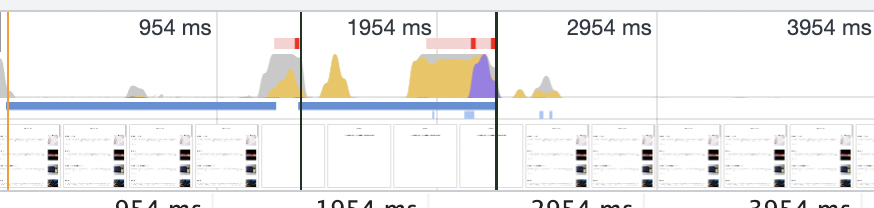
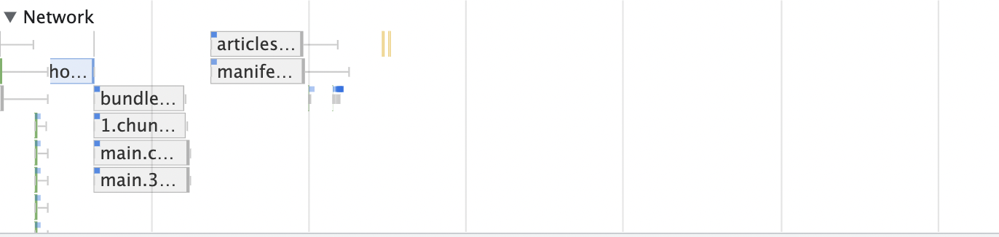

# lecture-1 블로그 서비스 최적화

## lighthouse 툴을 이용한 페이지 검사

- First Constenful Paint : 페이지가 로드될 때 브라우저가 DOM 콘텐츠의 첫 번째 부분을 렌더링하는 데 걸리는 시간에 관한 지표. 10%의 가중치
- Speed Index : 페이지 로드 중에 콘텐츠가 시각적으로 표시되는 속도를 나타내는 지표. 10%의 가중치
- Largest Contentful Paint : 페이지가 로드될 때 화면 내에 있는 가장 큰 이미지나 텍스트 요소가 렌더링되기까지 걸리는 시간을 나타내는 지표. 25%의 가중치
- Time to Interactive : 사용자가 페이지와 상호 작용이 가능한 시점까지 걸리는 시간을 측정한 지표. 10%의 가중치
- Total Blocking Time : 페이지가 클릭, 키보드 입력 등의 사용자 입력에 응답하지 않도록 차단된 시간을 총합한 지표. FCP와 TTI 사이의 시간동안 일어나는 메인스레드를 독점하여 다른 동작을 방해하는 작업에 걸린 시간을 총합. 30%의 가중치
- Cumulative Layout Shift : 페이지 로드 과정에서 발생하는 예기치 못한 레이아웃 이동을 측정한 지표. 15%의 가중치.

- Opportunities : 페이지를 더욱 빨리 로드하는 데 잠재적으로 도움되는 제안
- Diagnostics : 로드 속도와는 관련 X. 성능과 관련된 기타 정보

- 이미지 CDN

  - CDN(Content Delivery Network) 이란 물리적 거리의 한계를 극복하기 위해 소비자와 가까운 곳에 콘텐츠 서버를 두는 기술.

- perforamance 측정

  - cpu, network, screenshot

    - cpu 차트
    - </img>

      - 노란색 : 자바스크립트 실행 작업
      - 보라색 : 렌더링/레이아웃 작업
      - 초록색 : 페인팅 작업
      - 회색 : 기타 작업
      - 빨간색 선 : 병목이 발생하는 지점
      - 밑에 막대기 : 대략적인 network 상태. 위쪽 진한 막대기가 우선순위가 높은 네트워크 리소스, 아래 연한 막대가 우선순위가 낮은 네트워크

    - 네트워크 타임라인
    - </img>

      - 왼쪽 회색선 : 초기 연결 시간
      - 막대의 옅은 색 영역 : 요청을 보낸 시점부터 응답을 기다리는 시점까지의 시간(TTFB, Time to First Byte)
      - 막대의 짙은 색 영역 : 콘텐츠 다운로드 시간
      - 오른쪽 회색 선 : 해당 요청에 대한 메인 스레드의 작업 시간

    - frames, Timings, Main
      - 프레임 섹션은 변화가 있을 때 마다 스크린샷을 찍어 보여줌.
      - 타이밍 섹션은 user timing api 를 통해 기록된 정보를 기록. 각 컴포넌트의 렌더링 시간을 측정
      - 메인 섹션은 브라우저의 메인 스레드에서 실행되는 작업을 플레임차트로 보여주어 어떤 작업이 오래걸리는지 파악

  - Timing 과 메인스레드 해당 구간을 이용해서 오래걸리는 작업 확인. 수정하기
    - 병목 코드 개선

## 코드 분할 & 지연 로딩

- 0.chunk.js 파일이 다운로드 되는데 오래 걸림 -> 어떤 코드로 이루어졌는지 알기 위해 npm 사이트에서 **_webpack-bundle-analyzer_** 라는 패키지 다운로드.

  - 그러나 cra 에서는 불가능. 대체 : **_cra-bundle-analyzer_**
  - 분석을 통해, 크기가 너무 큰 모듈은 진입 목록에서 굳이 다운로드할 필요가 없기 대문에 하나로 합쳐져 있는 번들 파일 (chunk 파일?) 을 페이지별로 필요한 내용만 분리하여 필요할 때만 따로따로 로드하면 좋을 것 같다.

- 코드 분할 : 하나의 번들 파일을 여러 개의 파일로 쪼개는 방법.
-
